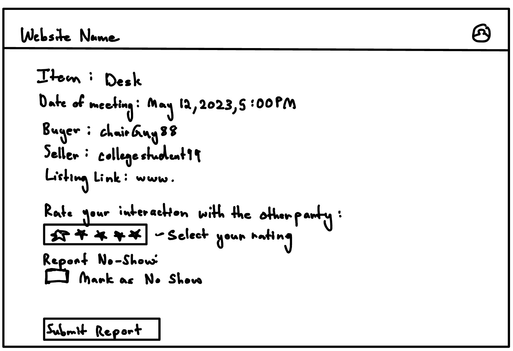
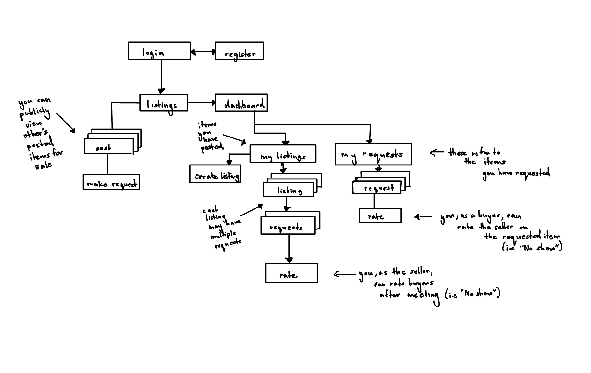

The content below is an example project proposal / requirements document. Replace the text below the lines marked "__TODO__" with details specific to your project. Remove the "TODO" lines.

(__TODO__: your project name)

# Shoppy Shoperson 

## Overview

(__TODO__: a brief one or two paragraph, high-level description of your project)

Remembering what to buy at the grocery store is waaaaay too difficult. Also, shopping for groceries when you're hungry leads to regrettable purchases. Sooo... that's where Shoppy Shoperson comes in!

Shoppy Shoperson is a web app that will allow users to keep track of multiple grocery lists. Users can register and login. Once they're logged in, they can create or view their grocery list. For every list that they have, they can add items to the list or cross off items.


## Data Model

(__TODO__: a description of your application's data and their relationships to each other) 

The application will store Users, Lists and Items

* users can have multiple lists (via references)
* each list can have multiple items (by embedding)

(__TODO__: sample documents)

An Example User:

```javascript
{
  username: "shannonshopper",
  hash: // a password hash,
  lists: // an array of references to List documents
}
```

An Example List with Embedded Items:

```javascript
{
  user: // a reference to a User object
  name: "Breakfast foods",
  items: [
    { name: "pancakes", quantity: "9876", checked: false},
    { name: "ramen", quantity: "2", checked: true},
  ],
  createdAt: // timestamp
}
```


## [Link to Commented First Draft Schema](db.mjs) 

(__TODO__: create a first draft of your Schemas in db.mjs and link to it)

## Wireframes

(__TODO__: wireframes for all of the pages on your site; they can be as simple as photos of drawings or you can use a tool like Balsamiq, Omnigraffle, etc.)

/login - page for users to log into their accounts

<!-- 
/register - page for users to create a new account


/listings - homepage displaying all available listings


/listings/:postId - page for showing a specific listing post


/listings/:postId/makeRequest - page for requesting a specific listing (item listed)


/dashboard - page for displaying overview of account activities


/dashboard/my-listings - page showing all listings created by user


/dashboard/my-listings/create - page for users to create a new listing


/dashboard/my-listings/:listingId/requests - page showing all requests others have made on a specific listing of the user


/dashboard/my-listings/:listingId/requests/:requestId/rate - page for the user to rate a specific request on one of their listings (e.g., rating "0 stars - no show" when a requester fails to pick up an item).


/dashboard/my-requests - page displaying all requests submitted by the user


/dashboard/my-requests/:requestId - page for viewing details of a specific request made by the user


/dashboard/my-requests/:requestId/rate - page for the user to rate a specific request (e.g., rating "0 stars - no show" when the seller fails to show up with the item)
 -->


## Site map



## User Stories or Use Cases

(__TODO__: write out how your application will be used through [user stories](http://en.wikipedia.org/wiki/User_story#Format) and / or [use cases](https://en.wikipedia.org/wiki/Use_case))

1. as non-registered user, I can register a new account with the site
2. as a user, I can log in to the site
3. as a user, I can create a new grocery list
4. as a user, I can view all of the grocery lists I've created in a single list
5. as a user, I can add items to an existing grocery list
6. as a user, I can cross off items in an existing grocery list

## Research Topics

(__TODO__: the research topics that you're planning on working on along with their point values... and the total points of research topics listed)

* (5 points) Integrate user authentication
    * I'm going to be using passport for user authentication
    * And account has been made for testing; I'll email you the password
    * see <code>cs.nyu.edu/~jversoza/ait-final/register</code> for register page
    * see <code>cs.nyu.edu/~jversoza/ait-final/login</code> for login page
* (4 points) Perform client side form validation using a JavaScript library
    * see <code>cs.nyu.edu/~jversoza/ait-final/my-form</code>
    * if you put in a number that's greater than 5, an error message will appear in the dom
* (5 points) vue.js
    * used vue.js as the frontend framework; it's a challenging library to learn, so I've assigned it 5 points

10 points total out of 8 required points (___TODO__: addtional points will __not__ count for extra credit)


## [Link to Initial Main Project File](app.mjs) 

(__TODO__: create a skeleton Express application with a package.json, app.mjs, views folder, etc. ... and link to your initial app.mjs)

## Annotations / References Used

(__TODO__: list any tutorials/references/etc. that you've based your code off of)

1. [passport.js authentication docs](http://passportjs.org/docs) - (add link to source code that was based on this)
2. [tutorial on vue.js](https://vuejs.org/v2/guide/) - (add link to source code that was based on this)

